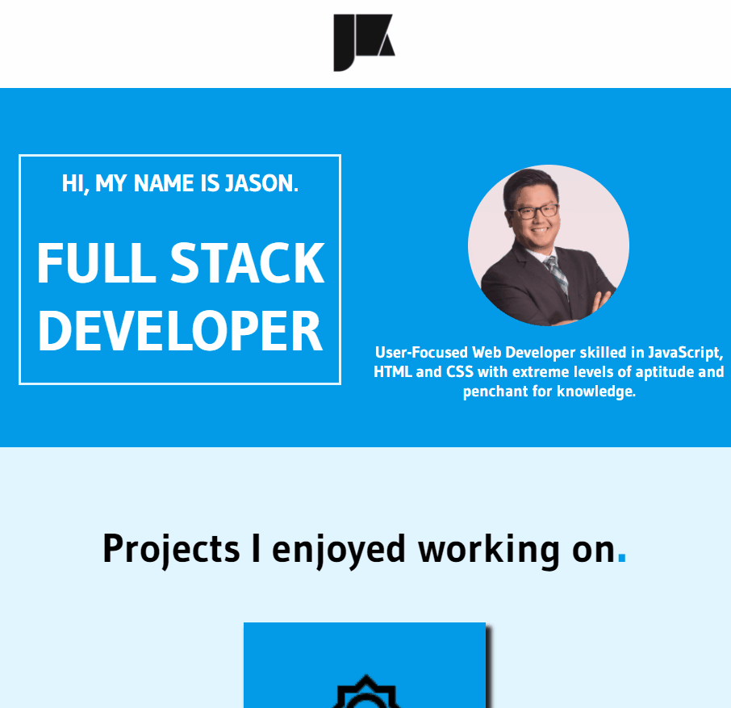

# Professional Portfolio

I wanted to be able to work from the ground up in rebuilding my portfolio page after gaining all the knowledge we did the past few months. My new portfolio tells users upfront what role I am in and what I am interested in doing. It contains a carousel from Bootstrap that displays some of the projects I've worked on. The portfolio also shows what technical skills I have learned via the logo icons and a short description of what the icon stands for. The portfolio also contains my contact information linked also through logo icons that will take you to gitHub, linkedIn, or draft a new email.

## Demo

  
## Lessons Learned

I learned about UX/UI end user experience from a colleague who deals with it for her profession. Many insights were gained and design concepts to consider moving forward. Another friend of mine was able to share his design school knowledge, although it wasn't for web design specifically, and it helped me improve immensely from my initial design seen in the "jsonKimify" repo. I also tried to stick it through with pure CSS, but Bootstrap had the fancy tools such as the carousel and lot of convenience in the pre-determined classes to render my 2nd iteration of my portfolio much faster. Unless I consider taking some design courses myself, I may rely more on Bootstrap moving forward to save time when it comes to front end experience.
  
## Deployment

https://eccentricality.github.io/professionalPortfolio/

  